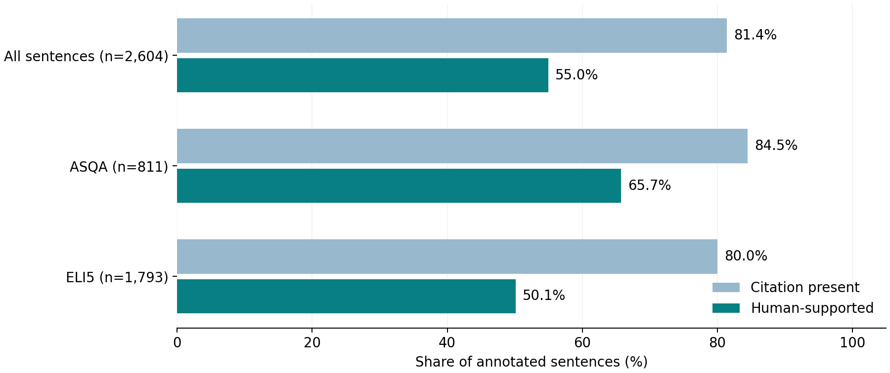

# Citation presence is not evidence support

A reproducible research portfolio study by Sena Inankul: a secondary analysis of
ALCE's published human-evaluation data, relevant to citation quality measurement
in GEO and LLM evaluation.

**Scope:** historical benchmark reanalysis, not a live ChatGPT/Google visibility
experiment. Source annotations were collected by the ALCE authors.

## Result

Across 800 answer records (778 non-empty) and 2,604 annotated sentences:

- 81.4% of sentences contain at least one annotated citation.
- 55.0% are supported by their cited evidence under the source human labels.
- Of 2,120 cited sentences, **688 (32.5%) lack full support**; question-cluster
  bootstrap 95% interval: 29.4%-35.6%.
- Automatic and human support labels disagree on **388 sentences (14.9%)**.

These findings concern evidence support, not factual accuracy in the world.
The sample contains 22 empty answers, reported separately from sentence measures.



## Reproduce

Python 3.11+; no model API key or paid service is required.

```bash
python -m pip install -r requirements.txt
python download_data.py
python -m unittest discover -s tests -v
python citation_audit.py
python make_figures.py
```

The downloader uses a pinned commit and validates SHA256. The source data is
downloaded from the original release, not stored as newly collected project data.
The eight automated tests cover denominators, empty responses, sentence alignment,
label validation, source integrity, clustering and full-release counts.

## Deliverables

- [Research brief](reports/GEO_Citation_Audit.pdf)
- [Measurements and uncertainty](reports/summary.json)
- [Sentence-level table](reports/sentences.csv), [answer inventory](reports/answers.csv),
  [configuration table](reports/configurations.csv)
- [Methodology](METHODS.md), [source provenance](SOURCE.md)
- [Protocol for a future live experiment](LIVE_EXPERIMENT_PROTOCOL.md) - proposed, not executed

## Research contribution

The project provides a clearly defined comparison, validation pipeline, derived
tables, clustered uncertainty estimates, figures and interpretation. The original
ALCE answers, human ratings and automatic labels are credited to Gao et al.
It makes no claim of client campaign uplift or present-day search performance.

## Sources

Gao, Yen, Yu and Chen (2023), *Enabling Large Language Models to Generate Text
with Citations*, EMNLP. [Paper](https://arxiv.org/abs/2305.14627),
[ALCE repository](https://github.com/princeton-nlp/ALCE).
The upstream MIT notice is retained in [data/LICENSE](data/LICENSE).

For the broader research context: Aggarwal et al. (2024), *GEO: Generative Engine
Optimization*, KDD. [Paper](https://arxiv.org/abs/2311.09735).
The present project does not reproduce or claim the GEO paper's optimisation results.
